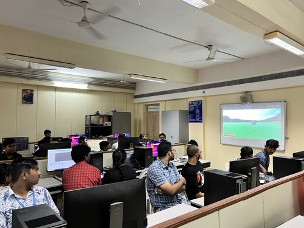
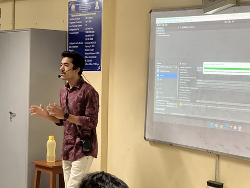
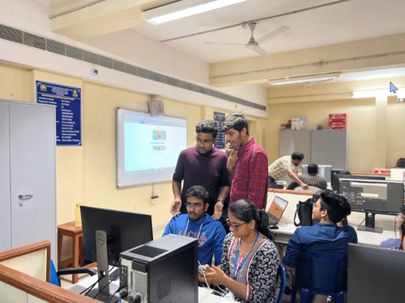

# Events Organised:  

## The Matrix:  

<!-- Recently we have conducted a two day workshop on Augmented Reality and virtual Reality.  The attended could able to deploy two ar apps into there phone. They learnt about what is VR&AR, able to learn basic controls in unity.  All the attendees were given a participation of certificate.  -->  
->The Matrix is a 2-day hands-on workshop conducted on Augmented reality and virtual reality.  
->The attendes could able to deloy two augmented reality applications on their android phone.  
->They were able to know about basic commands in unity,how to import packages...
->They also learnt ar&vr and the hmd(head-mounted displays) which are there in the market.  

  
  

